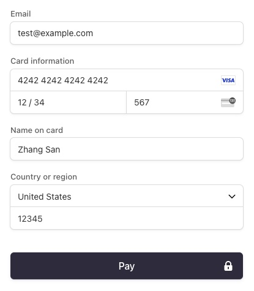
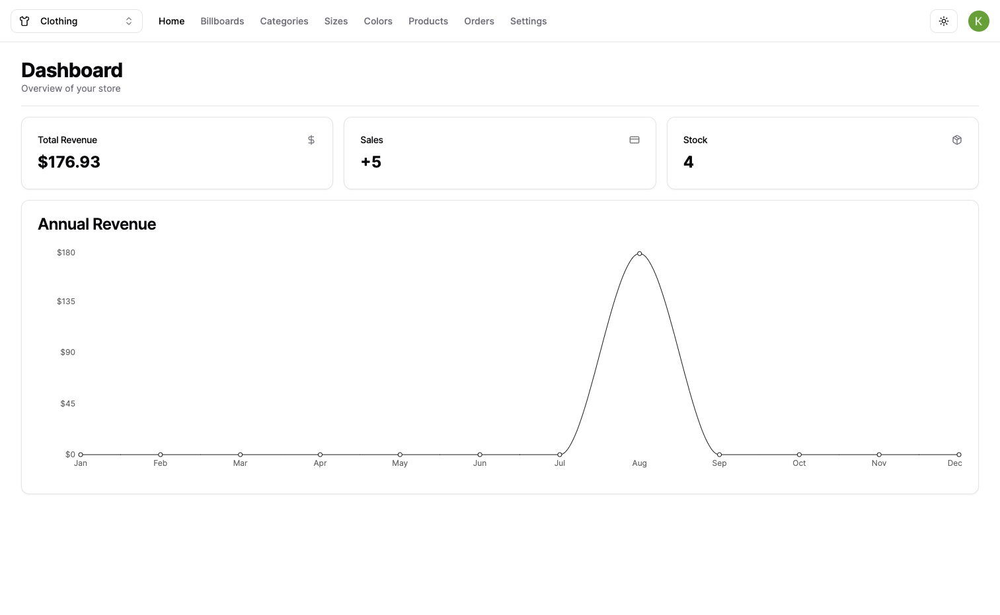
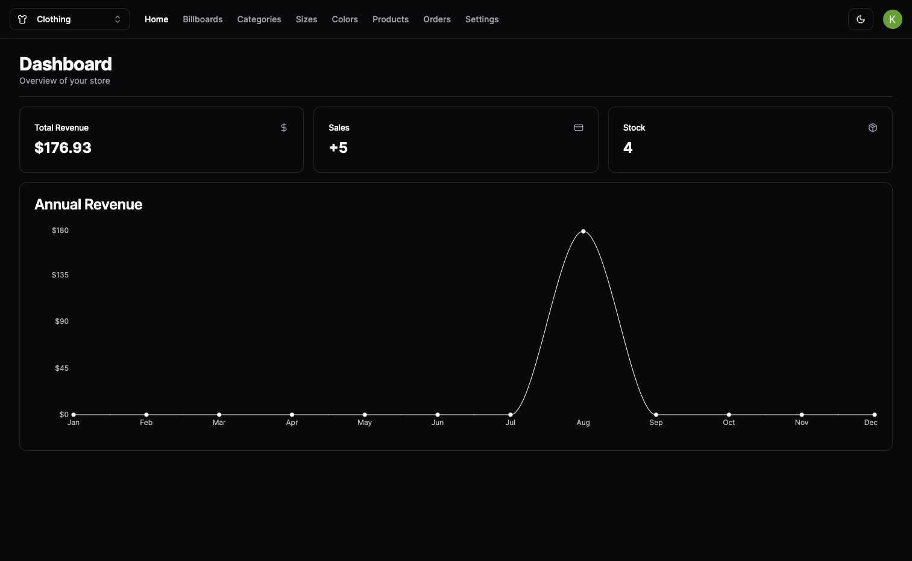
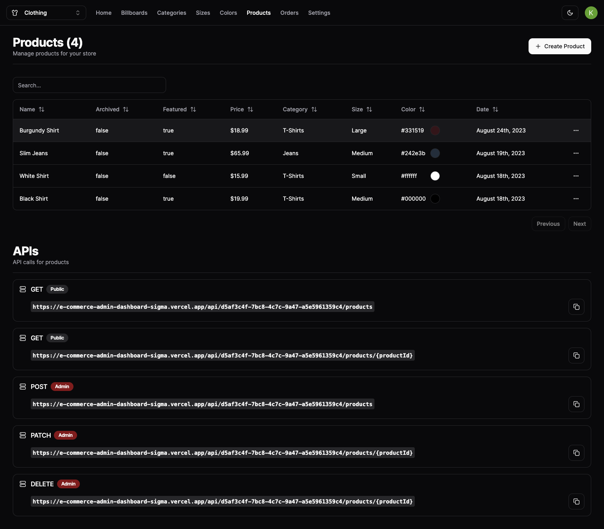
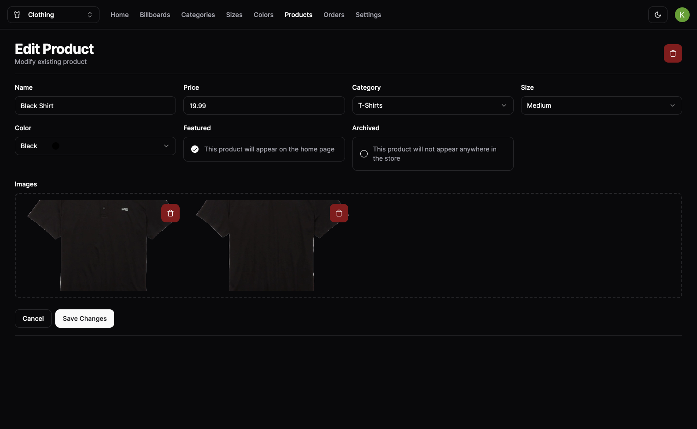
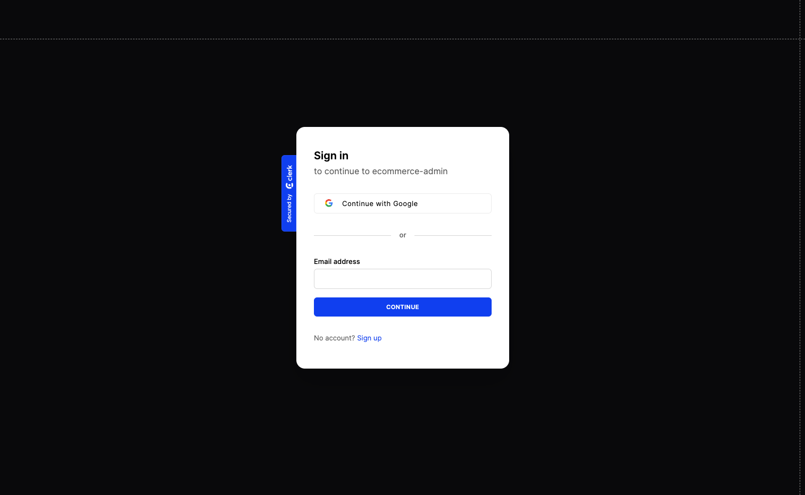

# E-commerce Admin Dashboard

Welcome to the E-commerce Admin Dashboard, your centralized hub for managing multiple online stores with ease. This Admin Dashboard empowers you to control various aspects of your e-commerce business, including product management, inventory, sales, and more. Built with Next.js, Shadcn UI, Tailwind CSS, AWS RDS for PostgreSQL, AWS S3 for image storage, and Clerk for authentication, it simplifies the management of your entire e-commerce ecosystem.

## Key Features

### Multi-Store Management

- Seamlessly manage multiple stores, such as clothes, food, computers etc., all from one centralized dashboard.
- Create, update, or delete billboards, categories, sizes, colors, and products across different stores.

### Efficient Data Handling

- Utilize tables with pagination and search functionalities to efficiently view and manage data.
- Streamline inventory management and easily feature products on the homepage or archive them.

### Data Visualization

- Gain insights into your e-commerce performance with graphical representations of orders, sales, and revenue using Recharts.

### Authentication with Clerk

- Securely authenticate administrators using Clerk, allowing them to sign in with either their Google accounts using OAuth2 or Email and Password.

### Payment Management with Stripe

- Manage payments effortlessly with Stripe integration, providing a seamless transaction experience.

### Theme Modes

- Enjoy a personalized user experience with support for both light and dark theme modes, enhancing readability and aesthetics.

### Order Confirmation

- Receive automatic email confirmations including a unique order tracking number once an order is placed, ensuring you're always in the know about your purchase.

## Demo

For demonstration purposes, admin routes has been intentionally disabled for production so that all visitors can view the admin website in its current state. Two separate stores, one for clothing and another for shoes, have been created with pre-configured products.

Explore the [E-commerce Admin Dashboard Demo](https://e-commerce-admin-dashboard-kpirabaharan.vercel.app/) to experience these features in action.

## Accompanied Store

### Github Page

**E-commerce Store Website GitHub:** [GitHub Repository](https://github.com/kpirabaharan/E-Commerce-Store)

### Website

Discover the multi-store feature by exploring the two distinct stores, showcasing the versatility of the e-commerce platform. Feel free to browse, add items to your cart, and complete the checkout process using the test card information provided below for a full experience.

**Click the links to explore the live websites:**

- [E-commerce Clothing Store Website](https://e-commerce-store-clothes-kpirabaharan.vercel.app/)
- [E-commerce Shoe Store Website](https://e-commerce-store-shoes-kpirabaharan.vercel.app/)

## Technologies Used

- Next.js: React framework for server-side rendering and building web applications
- Shadcn UI: A popular component library for building accessible and highly customizable user interfaces
- Tailwind CSS: Utility-first CSS framework for styling
- PostgreSQL: A powerful open-source relational database management system
- AWS RDS: Amazon Web Services Relational Database Service for managing PostgreSQL databases
- AWS S3: Amazon Web Services Simple Storage Service for storing images and other assets
- Clerk: Authentication service for securely managing user sign-ins
- Stripe: Payment processing platform for handling recurring payments
- Recharts: A composable charting library for building interactive data visualizations

## Screenshots

### Overview Page (Light)

### Overview Page (Dark)

### Products Page

### Edit Product Page

### Clerk Login Page

## License

This project is licensed under the [MIT License](https://opensource.org/licenses/MIT).

## Contact

If you have any questions or suggestions, please feel free to reach out:

- Email: kpirabaharan3@gmail.com
- LinkedIn: [https://linkedin.com/in/kpirabaharan/](https://linkedin.com/in/kpirabaharan/)
